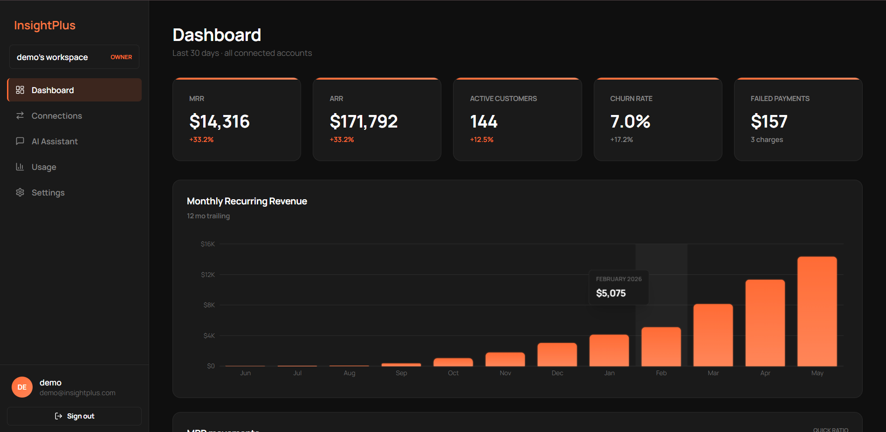
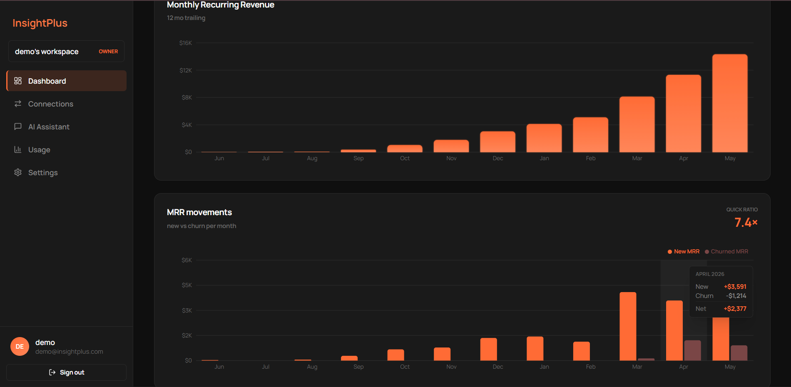
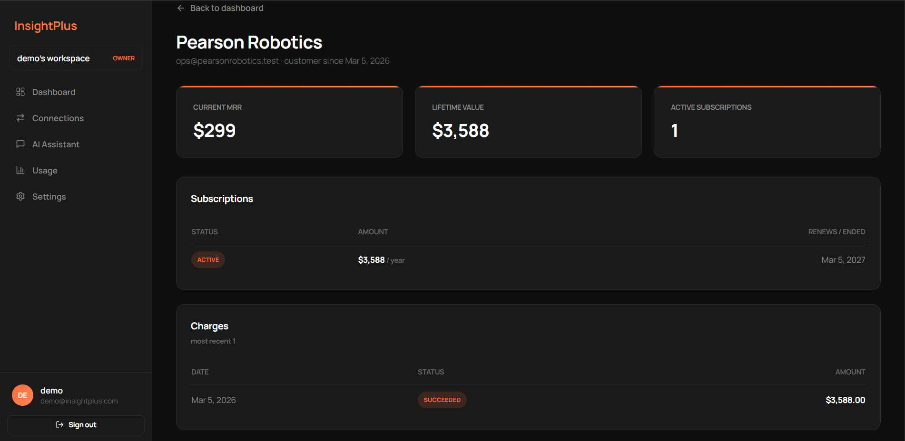
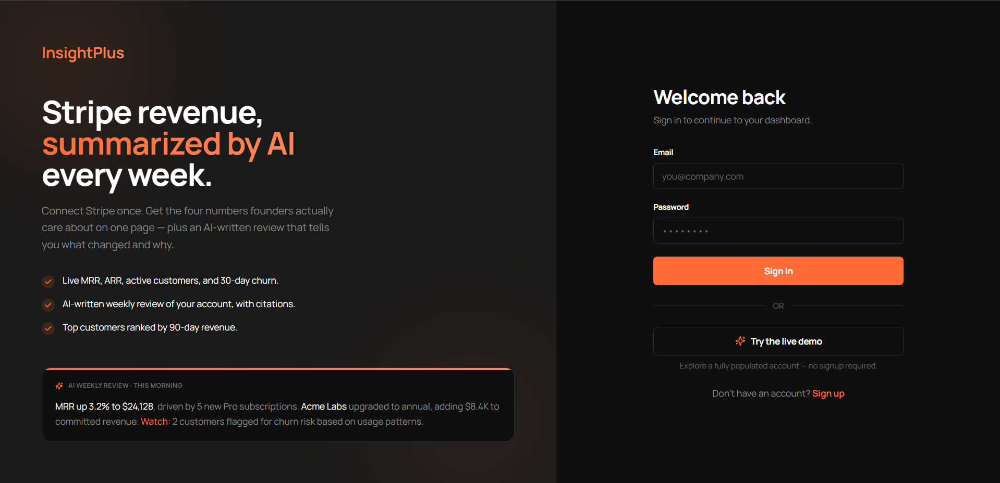
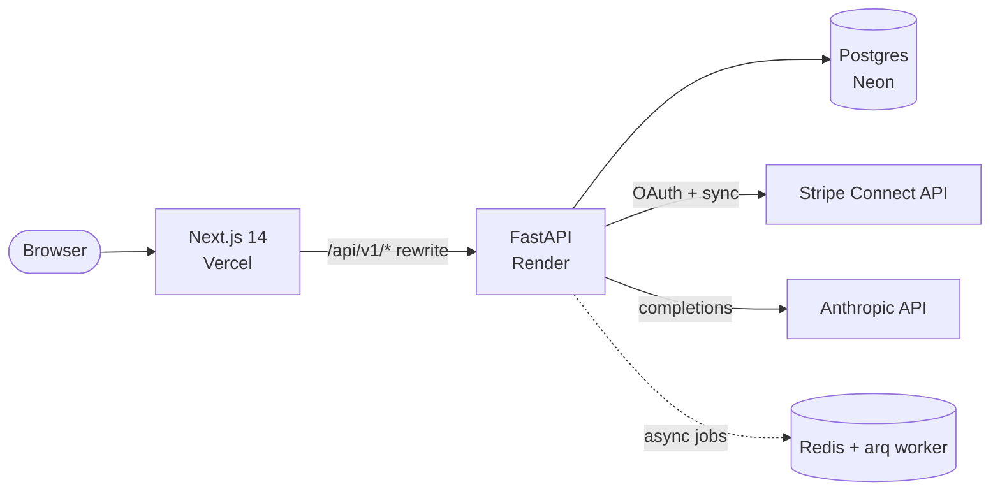

# InsightPlus

AI-powered revenue and customer intelligence for businesses on Stripe.
Two halves of one repo:

- **Backend** (this directory) — FastAPI + Postgres + arq + Anthropic.
  Auth, multi-tenancy, Stripe Connect, sync, AI calls + usage tracking.
- **Frontend** (`frontend/`) — Next.js 14 + Tailwind, "Ember Glow"
  dark theme. Talks to the backend over `/api/v1/*`.

See `frontend/README.md` for the frontend's own walkthrough.
**AI-powered revenue & customer intelligence for SaaS businesses on Stripe.**
Think Baremetrics meets a Claude analyst — your MRR, churn, and customer
movements on one page, with an AI-written weekly review that tells you
what changed and why.

<p align="center">
  <a href="https://insightplus.vercel.app">🔗 Live demo</a> ·
  <a href="#-screenshots">Screenshots</a> ·
  <a href="#-architecture">Architecture</a> ·
  <a href="#-running-locally">Run locally</a>
</p>

> [!NOTE]
> **Try it with one click** — the login page has a **"Try the live demo"**
> button that drops you straight into a fully populated account (≈160
> synthetic customers, a year of subscriptions and charges). No signup,
> no credit card. The data is generated, not real.



---

## What it is

InsightPlus connects to a Stripe account, mirrors its customers,
subscriptions, and charges into Postgres, and turns that raw data into
the handful of numbers a founder actually checks: **MRR, ARR, active
customers, churn, failed payments, and net MRR movement.** On top of
that sits an optional **Claude-powered weekly review** that reads the
synced metrics and writes a short, cited summary of the week.

It's a full-stack product, built solo as a portfolio piece — a
multi-tenant FastAPI backend, a Next.js dashboard, real OAuth, real
background sync, and a deployed pipeline across three cloud providers.

---

##  Highlights

- **Real revenue math, not placeholders.** MRR is normalised across
  billing intervals (daily/weekly/monthly/yearly → monthly cents);
  churn, quick ratio, and net new vs. churned MRR are computed from the
  synced ledger.
- **Stripe Connect, end to end.** OAuth authorize → callback bound by a
  one-time CSRF state token → token exchange → background sync of
  customers, subs, and charges, with a per-run audit log. Or connect with
  a **read-only restricted key** (`rk_…`) — full secret keys are rejected.
  Connected-account credentials are **encrypted at rest** (Fernet); the
  API never returns them, and disconnecting cascade-deletes all synced data.
- **An AI analyst, accounted for.** Every Anthropic call goes through a
  single wrapper with prompt caching and adaptive thinking, and writes a
  usage row (tokens, cache hits, **USD cost**) — even on failure.
- **Multi-tenant from the ground up.** Organizations + memberships +
  roles (`owner`/`admin`/`member`), every data request scoped by an
  `X-Organization-Id` header through one dependency.
- **Production-shaped auth.** JWT access + refresh with **rotation on
  every refresh**, refresh tokens stored **SHA-256-hashed at rest**,
  per-IP rate limiting, and reuse detection.
- **Operable.** Structured JSON logging with a request-ID on every line,
  `/health` + `/ready` probes, Alembic migrations gated in CI against a
  real Postgres.
- **Tested.** 110+ pytest cases covering auth, multi-tenancy, Stripe
  sync, and AI accounting (the Anthropic & Stripe SDKs are mocked).

---

##  Screenshots

| Dashboard | MRR movements & quick ratio |
| --- | --- |
|  |  |

| Customer detail | Sign-in / one-click demo |
| --- | --- |
|  |  |

---

##  Architecture



- The browser only ever talks to the Vercel domain. Next.js **rewrites**
  `/api/v1/*` to the FastAPI backend, so the API URL is never exposed
  client-side and there are no CORS round-trips for same-origin calls.
- The backend is stateless; all state lives in Postgres. Background sync
  and AI jobs run through arq/Redis when available, with an inline
  fallback so the app works without a worker.

| Layer | Choice |
| --- | --- |
| Frontend | Next.js 14 (App Router), TypeScript, Tailwind, TanStack Query, Recharts |
| Backend | FastAPI, SQLAlchemy 2.x, Pydantic v2 |
| Database | PostgreSQL (Neon) — SQLite for tests |
| Auth | JWT (HS256) access + refresh w/ rotation, bcrypt |
| Background | arq + Redis (inline fallback) |
| AI | Anthropic SDK (`claude-opus-4-7`), prompt caching, cost tracking |
| Payments | Stripe Connect OAuth + sync |
| Deploy | Vercel (web) · Render (API) · Neon (DB) |

---

##  Running locally

**Backend** (Python 3.12 recommended):

```bash
python -m venv venv && venv\Scripts\activate     # macOS/Linux: source venv/bin/activate
pip install -r requirements.txt
copy .env.example .env                            # then edit DATABASE_URL + secrets
alembic upgrade head
python scripts/seed_db.py                         # test users
python scripts/seed_demo_data.py                  # ~160 synthetic customers (no Stripe needed)
python main.py                                     # http://localhost:8000  · docs at /api/v1/docs
```

---

## API

Base path: `/api/v1`

### Authentication (`/auth`)

| Method | Path             | Description                                                          |
| ------ | ---------------- | -------------------------------------------------------------------- |
| POST   | `/auth/register` | Create an account (auto-provisions a personal organization)          |
| POST   | `/auth/login`    | Exchange credentials for an access + refresh token pair              |
| POST   | `/auth/refresh`  | **Rotates** the refresh token; returns a new access + refresh pair   |
| POST   | `/auth/logout`   | Revoke a refresh token                                               |
| GET    | `/auth/me`       | Current user + memberships (requires `Authorization: Bearer <token>`) |

### Organizations (`/orgs`)

| Method | Path           | Description                                                       |
| ------ | -------------- | ----------------------------------------------------------------- |
| GET    | `/orgs`        | List orgs the current user belongs to                             |
| POST   | `/orgs`        | Create a new org (caller becomes `owner`)                         |
| GET    | `/orgs/{id}`   | Get a specific org (403 if the user has no membership)            |

### Connections (`/connections`) — org-scoped (except the callback)

Stripe Connect OAuth and connected-data-source management.

| Method | Path                              | Description                                                                |
| ------ | --------------------------------- | -------------------------------------------------------------------------- |
| POST   | `/connections/stripe/connect`     | Returns a Stripe authorization URL; client navigates the user there.       |
| GET    | `/connections/stripe/callback`    | Stripe redirects here; **public**, bound to user by one-time state token.  |
| GET    | `/connections`                    | List the org's connected accounts (tokens never returned).                 |
| GET    | `/connections/{id}`               | Get one connection.                                                        |
| DELETE | `/connections/{id}`               | Disconnect: revoke at Stripe (best-effort) and remove the row.             |
| POST   | `/connections/{id}/sync`          | Enqueue a Stripe sync via arq. Returns `sync_log_id` immediately.          |
| GET    | `/connections/{id}/sync-logs`     | History of sync runs (newest first), with stats and any error.             |
| GET    | `/connections/{id}/customers`     | Synced customers for this connection.                                      |
| GET    | `/connections/{id}/subscriptions` | Synced subscriptions (filterable by `status`).                             |
| GET    | `/connections/{id}/charges`       | Synced charges (last 90 days by default — sync window).                    |

### Dashboard (`/dashboard`) — org-scoped

| Method | Path                          | Description                                                          |
| ------ | ----------------------------- | -------------------------------------------------------------------- |
| GET    | `/dashboard/overview`         | Current MRR, ARR, active customer count, churn rate (+ 30d deltas).   |
| GET    | `/dashboard/trends`           | 12 end-of-month MRR samples for the chart.                            |
| GET    | `/dashboard/top-customers`    | Top N customers by revenue over the last 90 days.                     |
| GET    | `/dashboard/movements`        | Per-month new vs. churned MRR movements for the chart.               |
| GET    | `/dashboard/activity`         | Recent account activity feed (signups, payments, churn).            |

### AI (`/ai`) — org-scoped, requires `X-Organization-Id` header
**Frontend:**

```bash
cd frontend
pnpm install
pnpm dev                                           # http://localhost:3000
```

Generate strong JWT secrets with
`python -c "import secrets; print(secrets.token_urlsafe(32))"`.
See [Configuration](#configuration) for the full env-var table.

> The `seed_demo_data.py` script also provisions the shared demo account
> (`demo@insightplus.com`) used by the one-click demo button.

---

## API

Base path `/api/v1`; interactive docs at `/api/v1/docs` (Swagger).

<details>
<summary><strong>Endpoint reference</strong> (click to expand)</summary>

### Auth (`/auth`)
| Method | Path | Description |
| --- | --- | --- |
| POST | `/auth/register` | Create account (auto-provisions a personal org) |
| POST | `/auth/login` | Credentials → access + refresh pair |
| POST | `/auth/demo` | One-click login into the shared seeded demo account |
| POST | `/auth/refresh` | **Rotates** the refresh token; returns a new pair |
| POST | `/auth/logout` | Revoke a refresh token |
| GET | `/auth/me` | Current user + memberships |

### Dashboard (`/dashboard`) — org-scoped
| Method | Path | Description |
| --- | --- | --- |
| GET | `/dashboard/overview` | MRR, ARR, active customers, churn, failed payments (+ deltas) |
| GET | `/dashboard/trends` | 12-month MRR trend |
| GET | `/dashboard/movements` | New vs. churned MRR per month |
| GET | `/dashboard/top-customers` | Top N by 90-day revenue |
| GET | `/dashboard/activity` | Recent signups, payments, cancellations |
| GET | `/dashboard/customers/{id}` | One customer: MRR, LTV, subscriptions, charges |

### Connections (`/connections`) — Stripe Connect, org-scoped
| Method | Path | Description |
| --- | --- | --- |
| POST | `/connections/stripe/connect` | Returns a Stripe authorize URL |
| GET | `/connections/stripe/callback` | OAuth callback, bound by one-time state token |
| POST | `/connections/stripe/api-key` | Connect with a read-only restricted key (`rk_…`) |
| GET/DELETE | `/connections/{id}` | Inspect / disconnect a connected account |
| POST | `/connections/{id}/sync` | Trigger a sync; returns a `sync_log_id` |
| GET | `/connections/{id}/customers\|subscriptions\|charges` | Synced data |

### AI (`/ai`) — org-scoped
| Method | Path | Description |
| --- | --- | --- |
| POST | `/ai/messages` | Synchronous Claude completion (records usage + cost) |
| POST | `/ai/jobs` · GET `/ai/jobs/{id}` | Async completion via arq, poll for result |
| GET | `/ai/usage` | Cumulative tokens + USD cost for the org |
| GET | `/ai/reviews/latest` · POST `/ai/reviews/generate` | Weekly AI review |

</details>

---

## Authentication & multi-tenancy

- **Access token** — short-lived JWT (30 min), stateless.
- **Refresh token** — long-lived, stored as a **SHA-256 hash**; every
  `/auth/refresh` revokes the old token and issues a new pair. A leaked
  DB row can't be replayed.
- **Org scoping** — tenant-data requests carry `X-Organization-Id`. One
  dependency resolves the user from the JWT, looks up the membership
  (403 if absent), and exposes the role for `require_role(...)`.

## Configuration

All config is env-driven via `app/core/config.py`. The essentials:

| Variable | Required | Notes |
| --- | --- | --- |
| `DATABASE_URL` | yes | `postgresql+psycopg2://…?sslmode=require` for Neon |
| `ACCESS_TOKEN_SECRET` / `REFRESH_TOKEN_SECRET` | yes | distinct high-entropy strings |
| `CORS_ORIGINS` | prod | comma-separated allowlist (the deployed frontend URL) |
| `ANTHROPIC_API_KEY` | for AI | required only to make real AI calls |
| `STRIPE_SECRET_KEY` / `STRIPE_CONNECT_CLIENT_ID` | for Stripe | platform keys for OAuth + sync |
| `DEMO_LOGIN_ENABLED` | no | toggles the one-click demo login (default on) |

The full table (rate limits, token TTLs, Stripe redirect URLs, etc.)
lives in `.env.example`.

---

## Testing

```bash
pytest               # full suite (per-test SQLite; Anthropic + Stripe mocked)
pytest -k auth       # filter
```

CI (`.github/workflows/ci.yml`) applies Alembic migrations against a real
Postgres service and runs the suite on every push.

---

## Project status

A portfolio project, actively iterated. Working today: auth,
multi-tenancy, Stripe Connect + sync, the full dashboard, synthetic
seeding, and the deployed pipeline. The AI weekly review is wired up and
runs as soon as an `ANTHROPIC_API_KEY` is configured.

**Roadmap:** chart annotations · email digests · CSV export · richer
cohort retention.

---

## License

Proprietary — all rights reserved. Built by [@P3N012](https://github.com/P3N012).
